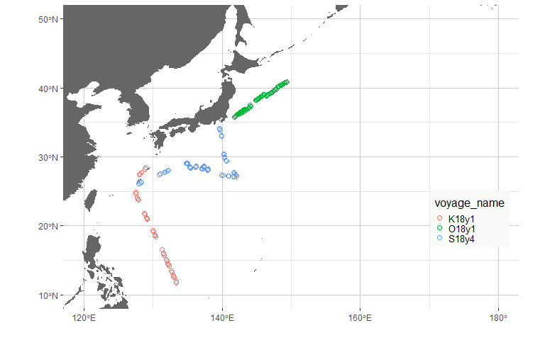

Marine Litter Analysis Manual
================

# 1\. Introduction

We’d like to demonstrate how marine litter analyses are conducted. In
the analysis, —expl

# 2\. Prerequisite

## 2.1 Installation of packages

If the follwing pacakges have not been installed, please execute next
commented lines first.

``` r
#install.packages("devtools")
#install.packages("dplyr")
library(devtools)
library(dplyr)

#install_github("y-yasutomo/malia")
#calling package in order to analyze marine debris data
library(malia)
```

# 3\. See Data and set up of estimation

## 3.1 Data handling

Create data for malia package Reading ‘raw’ data (at first time)
Sighting data

``` r
#Designate data name
#Data.name<-"おしょろ丸目視まとめC056"
#Rev.name<-"O18y1"
#Sight.hand(Data.name,Rev.name)
```

Effort data

``` r
#Designate data name
#Data.name<-"レグ番号順 おしょろC056"
#Rev.name<-"O18y1"
#Effort.hand(Data.name,Rev.name)
```

## 3.2 Data visualization

Survey track line

``` r
#Designate voyage name
Vname<-"O18y1"
survey.plot(read.csv(paste(Vname,".effort.csv",sep="")))
```

<!-- -->

## 3.3 Set up of estimation

Simple estimation using MALIA function Reading data

``` r
Sight.Data<-read.csv(paste(Vname,".debris.csv",sep=""))
Effort.Data<-read.csv(paste(Vname,".effort.csv",sep=""))
```

## 3.4 Estimation

We shall estimate density of ‘EPS’ by ‘MALIA’ function

``` r
tmp.Data<-Sight.Data %>%filter(type == "EPS")
res<-MALIA(tmp.Data,Effort.Data,key="hn",td=200)
```

    Start from 789.711634597682
    ite 1 value = 638.886473193106
    ite 2 value = 638.886473193106
    generated initial value!
    initial  value 638.886473 
    final  value 637.884609 
    converged

Densities in each
leg

``` r
leg.D.plot(res$leg.D.obs$leg.result,xl=c(120,160),yl=c(20,50),save=F,Type="EPS")
```

<!-- -->

## 3.5 Using full data

SDAM function can conduct whole analysis i.e) estimate detection
function, calculate densities in each debris type, covariate and
detection function As it takes some time to finish all trials, we use
already created results for mapping, model selection and making
table.

``` r
#res<-SDAM(Voyage.name=Vname,COVARIATE = c("conv", "occo","weather", "size"), key.list = c("hn","hr", "hhn", "hhr"),td=200,cp=10)
#Reading result object
res<-readRDS(paste(Vname,".result.obj",sep=""))
```

# 4\. Result handling

## 4.1 Drawing maps

Maps with trackline and estimated density

``` r
#let's see type 'EPS'
leg.D.res<-res$hhr$weather$EPS$leg.D.obs$leg.result
leg.D.plot(leg.D.res,save=F,Type='EPS')
```

<!-- -->

Density of “EPS” by grid

``` r
 grid.D.res<-res$hhr$weather$EPS$grid.D.res
 grid.D.plot(grid.D.res,save=F,Type='EPS')
```

<!-- -->

## 4.2 Model selection

model summary

``` r
 aic.mat<-aic.summary(res)
 aic.mat$EPS
```

``` 
    Key Covariate      AIC
1    hn      conv 1277.769
2    hr      conv 3394.093
3   hhn      conv 1291.816
4   hhr      conv 2444.953
5    hn      occo 1665.684
6    hr      occo 1211.122
7   hhn      occo 1254.887
8   hhr      occo 1148.979
9    hn   weather 1266.095
10   hr   weather 1216.888
11  hhn   weather 1252.324
12  hhr   weather 1156.173
13 <NA>      <NA>       NA
14 <NA>      <NA>       NA
15 <NA>      <NA>       NA
16 <NA>      <NA>       NA
```

model.extract function can extract best models in each debris type
easily from SDAM result

``` r
 best.model<-model.extract(aic.mat,res) 
 best.model$best.mat
```

``` 
    Key Covariate         AIC
DW  hhr   weather  651.510514
EPS hhr      occo 1148.979327
FGF hhr      conv   75.470455
FGN hhn      size   47.266631
FGO  hr      size   36.766292
FP  hhr      conv  171.723667
G    hn      conv    6.861077
M   hhn   weather   76.033831
NO  hhr      size  848.659985
PBA hhr      size  513.600085
PBO hhn   weather  257.996027
PC  hhr      size 1280.944963
SW  hhr      size 2068.776258
UK  hhr      conv   27.835253
UO  hhr      size  315.889185
W    hr      conv   47.545739
```

## 4.3 Creating table

Summary of densities by leg

``` r
 leg.table<-leg.D.table(best.model$best.list)
 head(leg.table)
```

``` 
  Voyage_name Leg.No. Leg.Length DW_Density DW_Abundance
1       O18y1       1   18.90206   4.111245     77.71101
  DW_Detected.Number EPS_Density EPS_Abundance EPS_Detected.Number
1                  1    16.81634      317.8635                  17
  FGF_Density FGF_Abundance FGF_Detected.Number FGN_Density FGN_Abundance
1   0.5702303      10.77853                   1           0             0
  FGN_Detected.Number FGO_Density FGO_Abundance FGO_Detected.Number
1                   0           0             0                   0
  FP_Density FP_Abundance FP_Detected.Number G_Density G_Abundance
1          0            0                  0         0           0
  G_Detected.Number M_Density M_Abundance M_Detected.Number NO_Density
1                 0  6.320801    119.4762                 1   1.237268
  NO_Abundance NO_Detected.Number PBA_Density PBA_Abundance
1     23.38691                  1    1.491695      28.19612
  PBA_Detected.Number PBO_Density PBO_Abundance PBO_Detected.Number
1                   1    11.96439      226.1517                  10
  PC_Density PC_Abundance PC_Detected.Number SW_Density SW_Abundance
1   7.330453     138.5607                  4   5.335478     100.8515
  SW_Detected.Number UK_Density UK_Abundance UK_Detected.Number UO_Density
1                  2          0            0                  0   12.93287
  UO_Abundance UO_Detected.Number W_Density W_Abundance W_Detected.Number
1     244.4579                  7  3.475549    65.69505                 1
  Lat.Start Lon.Start  Lat.End Lon.End
1  35.68841  141.6653 35.80892 141.813
 [ reached 'max' / getOption("max.print") -- omitted 5 rows ]
```

``` r
 #write.xlsx(leg.table,file=paste(table.pass,"leg.D.table.xlsx",sep=""),row.names=F)
```

Summary of densities by grid

``` r
 grid.table<-grid.D.table(best.model$best.list)
 head(grid.table)
```

``` 
   Voyage_name lat.min lat.max lon.min lon.max Total.length DW_Density
14       O18y1    35.5    36.0   141.5   142.0    42.658119  5.8793415
26       O18y1    35.5    36.0   142.0   142.5     6.396301  9.0399166
27       O18y1    36.0    36.5   142.0   142.5    57.057558  0.8387192
39       O18y1    36.0    36.5   142.5   143.0    59.763436  2.4715164
   EPS_Density FGF_Density FGN_Density FGO_Density FP_Density G_Density
14   10.332905   0.5053448   2.7670900    0.000000  0.7987498         0
26    2.513522   0.0000000   0.9640199    0.000000  1.7795218         0
27    2.277147   0.0000000   0.0000000    0.000000  0.7966613         0
39    2.367067   0.1727018   0.7806773    1.676246  2.5902512         0
   M_Density NO_Density PBA_Density PBO_Density PC_Density SW_Density
14 2.8007842  0.5482406    3.634846   6.3617901  13.515534   13.98354
26 0.0000000  0.0000000    2.207678   0.0000000  17.753716   29.07629
27 0.0000000  2.5177683    0.000000   1.4814525   3.533654   43.25810
39 0.3789837  1.3516362    5.568032   0.3694174  10.353659   25.55756
   UK_Density UO_Density W_Density
14   0.000000   5.730631  1.540036
26   0.000000   0.000000  0.000000
27   0.000000   1.398079  0.000000
39   2.325975   2.212597  1.030055
 [ reached 'max' / getOption("max.print") -- omitted 2 rows ]
```

``` r
 #write.xlsx(grid.table,file=paste(table.pass,"grid.D.table.xlsx",sep=""),row.names=F)
```

Summary of densities by area

``` r
 area.table<-area.D.table(best.model$best.list)
 head(area.table)
```

``` 
  Voyage_name Area Total.Length DW_Density EPS_Density FGF_Density
1       O18y1    1            0        NaN         NaN         NaN
2       O18y1    2            0        NaN         NaN         NaN
3       O18y1    3            0        NaN         NaN         NaN
4       O18y1    4            0        NaN         NaN         NaN
  FGN_Density FGO_Density FP_Density G_Density M_Density NO_Density
1         NaN         NaN        NaN       NaN       NaN        NaN
2         NaN         NaN        NaN       NaN       NaN        NaN
3         NaN         NaN        NaN       NaN       NaN        NaN
4         NaN         NaN        NaN       NaN       NaN        NaN
  PBA_Density PBO_Density PC_Density SW_Density UK_Density UO_Density
1         NaN         NaN        NaN        NaN        NaN        NaN
2         NaN         NaN        NaN        NaN        NaN        NaN
3         NaN         NaN        NaN        NaN        NaN        NaN
4         NaN         NaN        NaN        NaN        NaN        NaN
  W_Density
1       NaN
2       NaN
3       NaN
4       NaN
 [ reached 'max' / getOption("max.print") -- omitted 2 rows ]
```

``` r
 #write.xlsx(area.table,file=paste(table.pass,"area.D.table.xlsx",sep=""),row.names=F)
```

\#5. Ar and Nt products \#\#5.1. Classify each debris into categories
ls. function can sum up artificial and natural products

``` r
 Ar<-c("FGN","FGF","FGO","EPS","PBA","PBO","FP","PC","G","M","W","UO")
 Nt<-c("SW","DW","NO")
 An.table<-ls.(leg.table,Voyage.name,Ar,Nt)
 head(An.table)
```

``` 
  Leg.No. Leg.Length Lat.Start Lon.Start  Lat.End  Lon.End Voyage_name
1       1  18.902062  35.68841  141.6653 35.80892 141.8130       O18y1
2       2   9.823665  35.80892  141.8130 35.87148 141.8899       O18y1
3       3  18.586601  35.87148  141.8899 35.98891 142.0368       O18y1
4       4   9.038264  35.98891  142.0368 36.04769 142.1062       O18y1
5       5  18.423266  36.04769  142.1062 36.16471 142.2514       O18y1
6       6   9.174922  36.16471  142.2514 36.22143 142.3256       O18y1
  Artificial_Number Artificial_Density Natural_Number Natural_Density
1                42           60.90233              4        10.68399
2                15           48.48070              5        19.85985
3                17           30.11885             13        33.99661
4                 3           12.12651              9        49.12217
5                 7            7.37107             17        47.62894
6                 3           10.69208             17        90.80294
```

Plot of Artificial
product

``` r
 Artificial.leg<-An.table %>%  select(Leg.No.,Leg.Length,Lat.Start,Lon.Start,Lat.End,Lon.End,Artificial_Density) %>% rename(Density=Artificial_Density)
 leg.D.plot(Artificial.leg,save=F)
```

<!-- -->

``` r
 Artificial.grid<-grid.D(Artificial.leg)
 grid.D.plot(Artificial.grid,save = F)
```

<!-- -->

Plot of Natural
product

``` r
Natural.leg<-An.table %>%  select(Leg.No.,Leg.Length,Lat.Start,Lon.Start,Lat.End,Lon.End,Natural_Density) %>% rename(Density=Natural_Density)
 leg.D.plot(Natural.leg,save=F)
```

<!-- -->

``` r
 Natural.grid<-grid.D(Natural.leg)
 grid.D.plot(Natural.grid,save = F)
```

<!-- -->

## 5.2. Combining results

Combining results across multiple surveys. In this procedure, it is
necessary result objects has to already be created. Survey legs

``` r
 vname<-c("S18y4","O18y1","K18y1")
 tmp<-data.frame()
for(i in 1:length(vname)){
  Effort.Data<-read.csv(paste(vname[i],".effort.csv",sep=""))
  Effort.Data$voyage_name<-vname[i]
  tmp<-rbind(tmp,Effort.Data)
}
 survey.plot(tmp,multi=T)
```

<!-- -->

Combine leg D results In the leg.D.comb function, model selection and
extraction of the best model are conducted.

``` r
 tmp<-leg.D.comb(vname) 
#let's see type "DW"
 tmp2<-grid.D(tmp$DW)
 grid.D.plot(tmp2,save = F)
```

<!-- -->

``` r
#area D
 tmp3<-area.D(tmp$DW)
 tmp3$area.density
```

``` 
   Area    Density Total.Length
1     1        NaN       0.0000
2     2        NaN       0.0000
3     3        NaN       0.0000
4     4        NaN       0.0000
5     5        NaN       0.0000
6     6        NaN       0.0000
7     7 18.7962061    1034.6821
8     8        NaN       0.0000
9     9        NaN       0.0000
10   10  0.0000000     100.6888
11   11  0.2542736     217.3841
12   12  0.1216781     454.2729
13   13        NaN       0.0000
14   14        NaN       0.0000
15   15  0.1274597     564.9288
16   16        NaN       0.0000
17   17        NaN       0.0000
```

Artificial and Natural products Artificial product

``` r
 tmp<-vanc(vname)
 leg.D.plot(tmp$Ar.leg.D,save=F)
```

<!-- -->

``` r
 Artificial.grid<-grid.D(tmp$Ar.leg.D)
 grid.D.plot(Artificial.grid,save = F)
```

<!-- -->

Natural product

``` r
 leg.D.plot(tmp$Nt.leg.D,save=F)
```

<!-- -->

``` r
 Natural.grid<-grid.D(tmp$Nt.leg.D)
 grid.D.plot(Natural.grid,save = F)
```

<!-- -->
